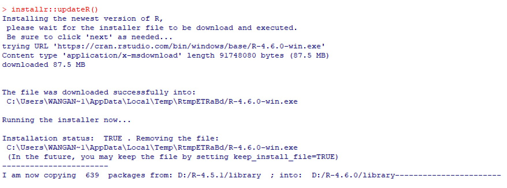
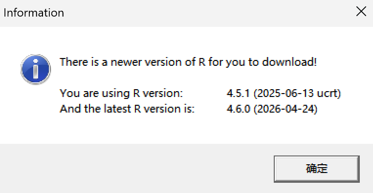
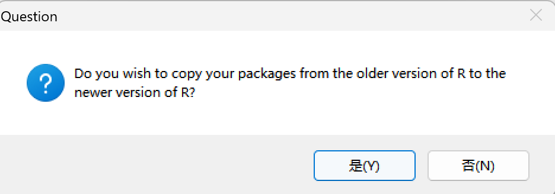
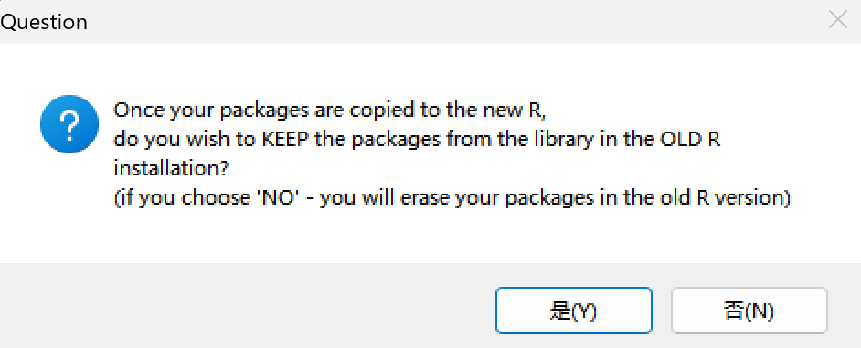
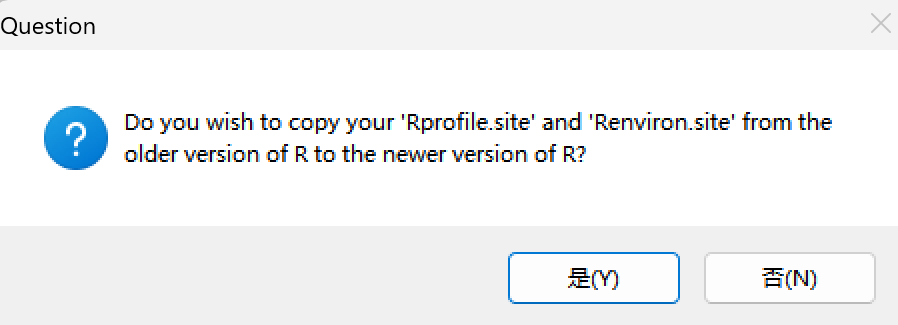
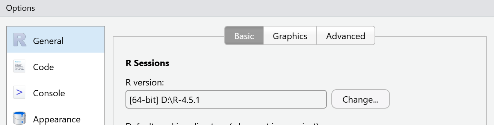

## R版本更新

```{r}
# 在RGui中执行
installr::updateR()
```

{fig-align="center" width="50%"}

### 安装RGui

{fig-align="center" width="50%"}

{fig-align="center" width="50%"}

### 迁移R包 

{fig-align="center" width="50%"} {fig-align="center" width="50%"}

### Rprofile/Renviron



### Rstudio -\> Tools -\> Global Options -\>General

{fig-align="center" width="75%"}

### Rconsole

```         
## Language for messages
language = 
```

↓

```         
## Language for messages
language = en
```

## Rstudio更新
